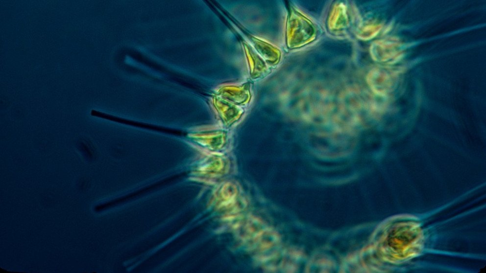

# Fitoplancton

Se denomina **fitoplancton** al conjunto de los organismos del plancton que tienen **capacidad fotosintética**. Se estudian como algas, pero se clasifican como bacterias o protistas. El grupo más grande que existe es el de las diatomeas.
Esta comunidad de organismos microscópicos es la base de la cadena de alimentación de los ecosistemas acuáticos. Además, es el principal responsable de la producción de oxígeno en el planeta.

```{r fitoplancton,echo=FALSE, out.width='80%', fig.align='center', fig.cap='El desarrollo excesivo del fitoplancton provoca la acumulación de toxinas que liberan contaminando los ecosistemas marinos'}

```


El fitoplancton es uno de los componentes centrales del módulo de calidad de aguas ya que influye, por medio de los procesos de fotosíntesis, respiración y muerte, en los balances de masas de los siguientes componentes: 

+ Oxígeno disuelto
+ Nitrógeno orgánico
+ Nitrógeno amoniacal
+ Nitratos
+ Fósforo orgánico e inorgánico
+ Carbono inorgánico

En el caso de no existir fitoplancton o de no modelarse, los procesos anteriores no se consideran en el modelo, pudiéndose en cualquier caso calcular el resto de sustancias sin considerar el fitoplancton. Por lo tanto, no es imprescindible activar el módelo de fitoplancton para calcular el resto de componentes del módulo de calidad de aguas.

El fitoplancton se representa en el modelo por medio de la concentración de clorofila-A (Chl-A). Si se modela el fitoplancton es necesario que el usuario defina su estequiometría, i.e. la relación entre nitrógeno, fósforo, carbono y Chl-A en el fitoplancton, ya que de ello dependen los balances de masa de dichos componentes del modelo. Los ratios que es necesario definir son los siguiente:

$$ r_{na}=\frac{mg \ N}{mg\ A} $$    
$$ r_{pa}=\frac{mg \ P}{mg A} $$     
$$ r_{na}=\frac{mg\ N}{mg \ A} $$
donde $N$, $P$, $O$, $C$ y $A$ representan la masa seca de nitrógeno, fósforo, oxígeno, carbono y Chl-A en el fitoplancton.
Asimismo, el usuario debe definir la masa de oxígeno generada/consumida por cada gramo de fitoplancton durante los procesos de fotosíntesis y respiración del fitoplancton:

$$ r_{oa}=\frac{mg\ O}{mg \ A} $$


En función del sustrato utilizado en la fotosíntesis (amonio o nitratos), la relación entre $r_{oa}$ y $r_{ca}$ oscila entre 2.67 (sustrato amonio) y 3.47 (sustrato nitratos). Es decir, $r_{oa} \approx 3r_{ca}$.

En el balance de masa de fitoplancton se consideran los siguientes procesos:

+ Fotosíntesis
+ Respiración
+ Muerte
+ Sedimentación


La masa de fitoplancton incrementa mediante el proceso de fotosíntesis, y se pierde mediante los procesos de respiración, muerte y sedimentación. En la ecuación de balance de masa del fitoplancton se considera un término fuente por cada uno de estos procesos:


\begin{equation} 
S_A =S^{foto}_A - S^{resp}_A  -S^{muerte}_A - S^{sed}_A 

  (\#eq:Sa)
\end{equation} 

Dichos procesos se modelan mediante las formulaciones que se describen a continuación.
